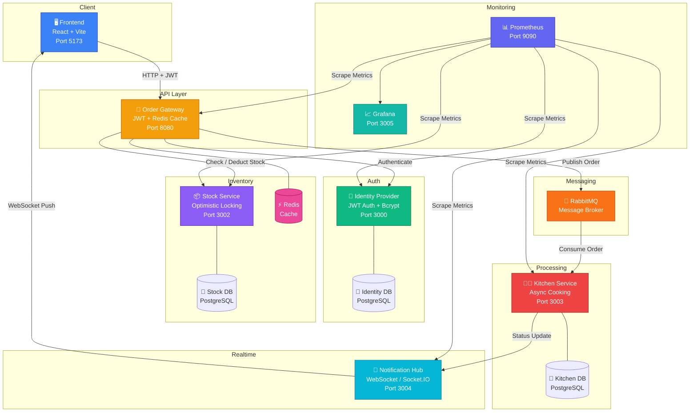

# EzIftar - Resilient Microservices Cafeteria Ordering System

EzIftar is a distributed, fault-tolerant microservice system designed to handle the IUT Cafeteria's Ramadan Iftar ordering rush. The system breaks a fragile monolith into independent, containerized services that communicate over the network, ensuring reliability under heavy load.

---

## Features

- End-to-end microservices architecture (6 services, 13 containers)
- Real-time order tracking with WebSockets
- Fault tolerance: circuit breaker, chaos toggles, graceful degradation
- Optimistic locking, Redis caching, JWT authentication
- Live metrics, Grafana dashboards, and full audit trail
- Automated testing and CI/CD pipeline

---

## Architecture Overview



## Services

| Service               | Port | Description                                               |
| --------------------- | ---- | --------------------------------------------------------- |
| **Identity Provider** | 3000 | JWT authentication & authorization, rate limiting (3 attempts/min)        |
| **Order Gateway**     | 8080 | API Gateway with JWT validation, Redis cache stock check & circuit breaker |
| **Stock Service**     | 3002 | Inventory management with optimistic locking & idempotency |
| **Kitchen Service**   | 3003 | Async order processing via RabbitMQ (3-7s cooking simulation) |
| **Notification Hub**  | 3004 | Real-time WebSocket (Socket.IO) status updates            |
| **Frontend**          | 5173 | React SPA — student ordering, live tracker, admin dashboard |

## Quick Start

### Prerequisites

- Docker and Docker Compose installed

### Run the System

```bash
docker compose up -d --build
```

All services start in dependency order — databases and brokers initialize first, then application services connect once dependencies are healthy.

### Access Points

| Service                 | URL                                    |
| ----------------------- | -------------------------------------- |
| **Frontend**            | http://localhost:5173                  |
| **API Gateway**         | http://localhost:8080                  |
| **Grafana**             | http://localhost:3005 (admin/admin)    |
| **Prometheus**          | http://localhost:9090                  |
| **RabbitMQ Management** | http://localhost:15672 (user/password) |

## Student Journey

1. **Register/Login** → Obtain JWT token (auto-login on registration)
2. **Browse Menu** → View available Iftar items with live stock counts
3. **Place Order** → Authenticated order triggers: cache check → stock deduction → kitchen queue
4. **Live Tracking** → Real-time status via WebSocket: Pending → Stock Verified → In Kitchen → Ready
5. **Order History** → Full audit trail including failed orders

## API Endpoints

### Authentication

- `POST /api/auth/register` - Register new student (returns JWT)
- `POST /api/auth/login` - Login & receive JWT (rate limited: 3 attempts/min)

### Orders (Protected - requires Bearer token)

- `POST /api/orders` - Place an order
- `GET /api/orders` - Get order history (includes failed orders)

### Stock

- `GET /api/stock/items` - Get all menu items with stock

### Admin (Protected)

- `POST /api/admin/chaos/:service` - Kill a service (chaos toggle)
- `POST /api/admin/restore/:service` - Restore a killed service

### Health & Metrics

- `GET /api/health/{service}` - Health check per service
- `GET /api/metrics/{service}` - Prometheus metrics per service

## Resilience Patterns

| Pattern | Implementation |
| --- | --- |
| **JWT Authentication** | All order routes protected with token validation |
| **Redis Caching** | Zero-stock fast rejection without hitting DB |
| **Optimistic Locking** | Version-based concurrency control prevents over-selling (up to 15 retries with backoff) |
| **Circuit Breaker** | Protects stock-service calls — opens after 5 failures, auto-resets after 10s |
| **Async Processing** | Kitchen service decouples acknowledgment (<2s) from cooking (3-7s) via RabbitMQ |
| **Idempotency** | Prevents duplicate stock deduction on retries (both gateway-level and service-level) |
| **WebSocket + Auto-Reconnect** | Real-time updates via Socket.IO with automatic reconnection on server disconnect |
| **Graceful Degradation** | Notification hub down → frontend auto-switches to polling, recovers on restore |
| **Failed Order Tracking** | Orders that fail (circuit breaker, service down) are recorded in DB for audit trail |

## Fault Tolerance Demo

The **Admin Dashboard** includes a chaos toggle to kill/restore services and observe system behavior:

| Scenario | Expected Behavior |
| --- | --- |
| **Kill Notification Hub** | WebSocket disconnects → frontend falls back to DB polling every 5s → orders still process via RabbitMQ → on restore, WebSocket auto-reconnects and shows "real-time updates active" |
| **Kill Stock Service** | Orders fail immediately → circuit breaker opens after 5 failures → failed orders tracked in history → on restore, circuit breaker resets → orders succeed again |
| **Kill Kitchen Service** | Orders accepted (stock deducted) but stay at STOCK_VERIFIED → kitchen requeues messages → on restore, cooking resumes and orders complete |

## Monitoring

- **Health Grid**: Green/Red indicators per microservice (real-time via WebSocket)
- **Live Metrics**: Per-service business metrics (orders, latency, cache hits)
- **Grafana Dashboard**: 8-panel comprehensive monitoring at http://localhost:3005
- **Visual Alert**: Red badge if avg gateway latency > 1s over 30s window

## Testing

### Bash (Linux/macOS)

```bash
# Run unit tests (83 tests across 5 services)
docker compose exec identity-provider bun test   # 11 tests
docker compose exec stock-service bun test        # 16 tests
docker compose exec kitchen-service bun test      # 14 tests
docker compose exec order-gateway bun test        # 33 tests

# Notification Hub runs on node:18-alpine (for Socket.IO WebSocket support),
# so tests must run in a separate Bun container:
docker run --rm -v "$(pwd)/services/notification-hub:/app" -w /app oven/bun bun test  # 9 tests

# Run integration tests (16 tests against live stack)
docker run --rm \
       -v "$(pwd)/tests/integration:/tests" \
       -e GATEWAY_URL=http://order-gateway:8080 \
       -e STOCK_SERVICE_URL=http://stock-service:3002 \
       --network eziftar_default \
       oven/bun sh -c "cd /tests && bun install && bun test --timeout 30000"

# Run load test
chmod +x scripts/load-test.sh
./scripts/load-test.sh
```

### PowerShell (Windows)

```powershell
# Run unit tests (83 tests across 5 services)
docker compose exec identity-provider bun test   # 11 tests
docker compose exec stock-service bun test        # 16 tests
docker compose exec kitchen-service bun test      # 14 tests
docker compose exec order-gateway bun test        # 33 tests

# Notification Hub runs on node:18-alpine (for Socket.IO WebSocket support),
# so tests must run in a separate Bun container:
docker run --rm -v "${PWD}/services/notification-hub:/app" -w /app oven/bun bun test  # 9 tests

# Run integration tests (16 tests against live stack)
docker run --rm `
       -v "${PWD}/tests/integration:/tests" `
       -e GATEWAY_URL=http://order-gateway:8080 `
       -e STOCK_SERVICE_URL=http://stock-service:3002 `
       --network eziftar_default `
       oven/bun sh -c "cd /tests && bun install && bun test --timeout 30000"


```

##### Run load test (Windows)
```
# Option 1: Open Git Bash or WSL and run:
./scripts/load-test.sh

# Option 2: In PowerShell (with Git Bash installed), run:
bash ./scripts/load-test.sh

# If you do not have Bash installed, you can install [Git for Windows](https://git-scm.com/download/win) or enable [WSL](https://docs.microsoft.com/en-us/windows/wsl/install).
```
See TESTING_GUIDE.md for more details and troubleshooting.

---
## CI/CD

GitHub Actions pipeline runs on every push to `main`:

- Builds all services
- Runs unit tests
- Runs integration/load tests
- Fails on test failure
